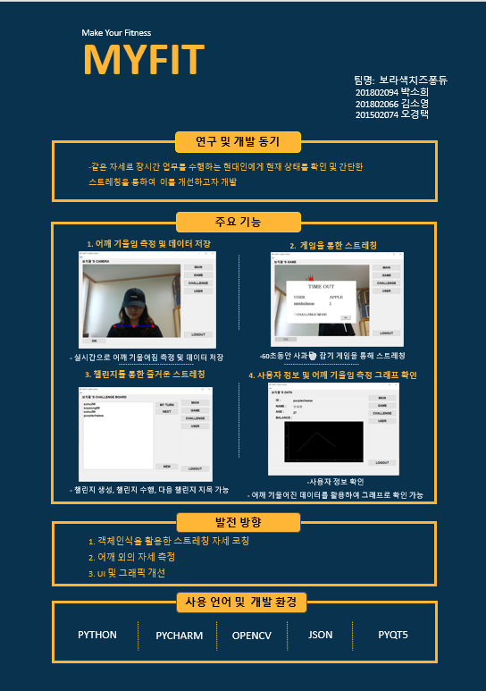

# BOTTOMUP - MYFIT
Make Your Fitness

## Team
### 보라색치즈퐁듀
201502074 오경택 
201802066 김소영 
201802094 박소희 

## Introduce
Most modern people in today's world have to work long hours in the same posture for long periods of time. In particular, office workers who work at their desks often suffer from pain, such as frequent cramps in certain body parts like shoulders. So, we wanted to help users relieve their physical fatigue by having them check their physical balance and stretch through our programs.

</img>

## Environment
- Language & Technique
  - Code: Python/ openCV
  - GUI: PyQt5/ pyqtgraph
  - DB: Json
  - Trained Model: OpenPose
  
- Trained Model
  - "pose_iter_440000.caffemodel"  
      from Deep learning based human pose estimation using opencv (cpp/python) 
  : <https://www.learnopencv.com/deep-learning-based-human-pose-estimation-using-opencv-cpp-python/>
